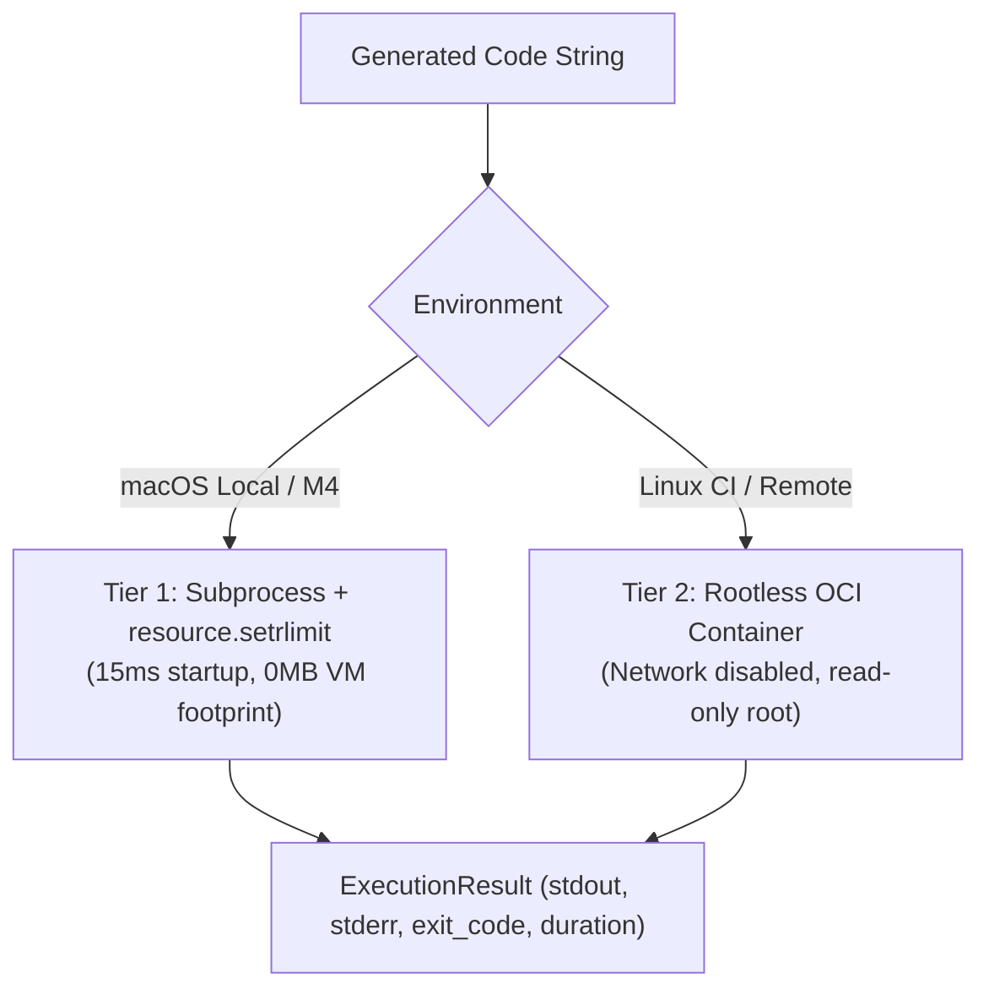
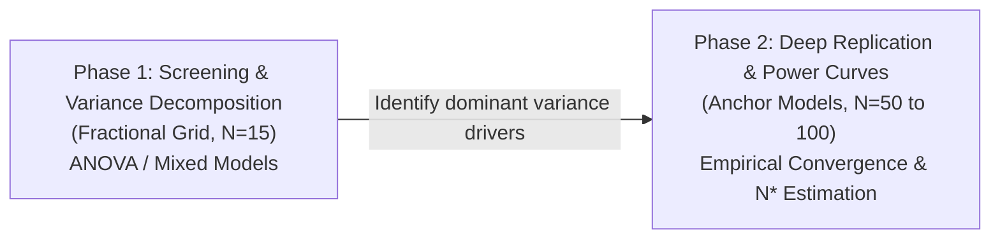

# ADR-001: Flexible Research Harness for Repeated LLM Stability Evaluation

- **Status:** Accepted (Master Architecture Specification)
- **Date:** 2026-09-10
- **Decision Owners:** Julia Krempińska and Thesis Supervisor
- **Scope:** Complete research harness for repeated evaluation of LLM-generated tabular data-analysis workflows
- **Supersedes:** None (First Master Architecture Record)
- **Related Documents:**
  - `docs/prd.md` — Thesis prospectus and PRD
  - `docs/tasks.md` — Synthetic masking and task evaluation specifications
  - `docs/inference.md` — Unified LLM inference engine documentation
  - `docs/sandbox.md` — Execution sandbox documentation

---

## 1. Decision Summary

Build a **modular, experiment-oriented research harness** structured around a **decoupled three-stage pipeline (Inference $\to$ Execution $\to$ Scoring)** using a **dual-tier sandbox** and **partitioned append-only JSONL storage** queried via DuckDB.

The architecture strictly separates the software harness from the statistical domain:
1. **Core Rule:** A change in thesis scope, statistical model, metric, or task configuration **MUST NOT** require rewriting the experiment orchestrator, invalidating raw evidence, or re-running expensive LLM inferences.
2. **Scientific Primary Focus:** The core academic contribution of this Master's thesis is **mathematical and statistical** (variance decomposition, bootstrap convergence, and sample size $N^*$ determination). Software engineering is strictly an enabler, prioritized for scientific traceability, low iteration cost, and reproducibility rather than enterprise breadth.

---

## 2. Context & Competing Forces

The thesis investigates repeated LLM evaluations for tabular data science tasks to eliminate the "single-run fallacy." Developing this harness requires balancing several acute, competing forces:

* **Force 1: Mathematical Rigor vs. Software Engineering Scope:**
  The thesis belongs to Applied Mathematics / Data Science. Spending excessive time building distributed orchestration or general-purpose AutoML frameworks risks starving the statistical modeling and empirical variance analysis.
* **Force 2: Hardware Constraints vs. Untrusted Code Isolation:**
  The primary experimental platform is a fanless **MacBook Air M4 (24 GB Unified Memory, 512 GB SSD)** running local quantized models (Qwen-2.5-Coder 7B/14B, LLaMA 3.1 8B). Running Docker on macOS requires a Linux VM that reserves 4–8 GB of RAM and adds 1.5–3.0 seconds of container spin-up overhead per run. Over 10,000 runs, this causes severe memory contention, thermal throttling, and 5+ hours of wasted idle VM boot time.
* **Force 3: Combinatorial Matrix Explosion vs. Repetition Depth ($N$):**
  A full factorial crossing of candidate models, temperatures, top-$p$, prompt styles, masking mechanisms, datasets, and $N=50$ repetitions produces $>60,000$ runs. Unchecked, this would exceed local runtime capacity and cloud API budgets.
* **Force 4: Deterministic Ground Truth vs. Task Realism:**
  Code generation for open-ended data tasks (like EDA or complex feature engineering) lacks unique ground truth, tempting the use of LLM-as-a-judge. However, LLM judges introduce secondary stochasticity and cost, confounding the measurement of target model variance.
* **Force 5: Inode Scalability vs. Atomic Auditability:**
  Storing one individual JSON file and one CSV per run across tens of thousands of trials causes severe filesystem degradation on macOS APFS. Conversely, storing everything in a binary database sacrifices raw file inspectability via standard Unix tools (`jq`, `grep`).

---

## 3. Architectural Invariants (Non-Negotiable)

The following invariants are classified as **Permanent & Stable**:

1. **Evidence Precedes Aggregation:** Every LLM query and execution attempt **MUST** produce an immutable raw record before parsing, scoring, or aggregation. Aggregated tables are derived views that can always be deterministically re-computed.
2. **Three-Stage Pipeline Decoupling:** Generation, Execution, and Scoring **MUST** exist as independent, idempotent stages communicating via content-addressed hashes. Scoring logic updates **MUST NOT** trigger re-execution; execution environment updates **MUST NOT** trigger re-inference.
3. **Failures are First-Class Observations:** Timeouts, OOM errors, syntax errors, schema violations, and API rate-limits **MUST** be recorded as typed categorical outcomes. They **MUST NEVER** be silently dropped, retried into oblivion, or converted to missing rows.
4. **Deterministic Evaluation Core:** The primary benchmark metric **MUST** be computable without LLM judges. Subjective evaluators are strictly out-of-scope for the core variance framework.
5. **Traceable Provenance:** Every scored result **MUST** be traceable back to exact prompt hashes, dataset content hashes, model system fingerprints, decoding parameters, and execution environment specifications.

---

## 4. Architectural Decisions

### 4.1 Execution Sandboxing: Dual-Tier Runtime Strategy

To resolve the tension between execution security and Apple Silicon hardware limits:

* **Tier 1 (Default / Local macOS): Isolated POSIX Subprocess**
  * Executed in a dedicated ephemeral temporary directory via `subprocess.run([sys.executable, ...])`.
  * Enforced wall-clock timeout (`timeout_sec = 15.0`).
  * POSIX resource limits enforced via `resource.setrlimit` (limiting CPU execution time, virtual address space, and child process creation).
  * Startup overhead is $<15\text{ ms}$, with zero background VM memory reservation.
* **Tier 2 (Linux / Remote / CI): Containerized Isolation**
  * Docker/Podman container with unprivileged user, dropped capabilities (`--cap-drop=ALL`), read-only root filesystem, no network (`--network=none`), and strict memory limits (`--memory=2g`).
  * Used for CI validation and high-volume runs offloaded to remote Linux servers.



### 4.2 Storage Strategy: Partitioned JSONL + DuckDB

To prevent filesystem inode exhaustion while retaining atomic transparency:

* **Raw Layer:** Run evidence is appended to **partitioned JSON Lines (JSONL)** files grouped by experiment and task:
  `runs/raw/<experiment_id>/<task_id>.jsonl`
* **Artifact Blobs:** Clean input datasets and uniquely generated output tables are stored content-addressed under `data/artifacts/<sha256>.parquet`.
* **Derived Analytical Layer:** Analytical queries and statistical pipelines query raw JSONL files directly using **DuckDB**:
  ```sql
  CREATE VIEW run_summary AS
  SELECT * FROM read_json_auto('runs/raw/*/*.jsonl');
  ```
  DuckDB provides columnar Parquet performance for bootstrap and mixed-effects modeling without requiring a running database server.

### 4.3 Task Scope: Imputation-First Focus

To safeguard mathematical depth:

* **Primary Empirical Benchmark:** **Task A: Missing Value Imputation** is the primary vehicle for the thesis. It provides unambiguous mathematical ground truth via synthetic masking (MCAR, MAR, MNAR) at controlled rates ($\alpha \in \{0.1, 0.3\}$), evaluated via:
  $$\text{NRMSE} = \frac{\sqrt{\frac{1}{|M|} \sum_{(i,j) \in M} (X_{ij} - \hat{X}_{ij})^2}}{\sigma(X_M)}$$
* **Extensibility:** Tasks B (Feature Transformation) and C (EDA) remain defined as abstract plugin interfaces (`BaseTask`) in the codebase for pilot studies or post-thesis benchmarks, but will not gate thesis completion.

### 4.4 Experiment Design: Two-Phase Factorial Architecture

To resolve the combinatorial explosion:



1. **Phase 1: Screening & Variance Decomposition ($N = 15$):**
   * Fractional factorial across all candidate models (local + cloud), temperatures ($T \in \{0.0, 0.2, 0.7\}$), and masking mechanisms.
   * Objective: Estimate fixed effects and random variance components ($\sigma^2_{\text{model}}$, $\sigma^2_{\text{temp}}$, $\sigma^2_{\text{dataset}}$) via Linear Mixed-Effects Models (LMM).
2. **Phase 2: Deep Asymptotic Replication ($N = 50 \text{ to } 100$):**
   * Executed strictly on selected anchor conditions (e.g. 1 representative local model, 1 cloud model, across 2 datasets).
   * Objective: Trace empirical bootstrap confidence interval contraction, estimate ranking stability, and calibrate the sample size estimator $N^*$.

---

## 5. System Architecture & Component Contracts

### 5.1 Component Topology

```text
┌─────────────────────────────────────────────────────────────┐
│ 1. INFERENCE STAGE                                          │
│ TaskSpec + InferenceConfig ──► InferenceEngine (Ollama/API) │
│                                      │                      │
│                                      ▼                      │
│                           runs/raw/.../inference.jsonl      │
└──────────────────────────────────────┬──────────────────────┘
                                       │
┌──────────────────────────────────────▼──────────────────────┐
│ 2. EXECUTION STAGE                                          │
│ GenerationRecord ──► CodeExtractor ──► Sandbox (Tier 1/2)   │
│                                              │              │
│                                              ▼              │
│                                 runs/raw/.../execution.jsonl│
└──────────────────────────────────────┬──────────────────────┘
                                       │
┌──────────────────────────────────────▼──────────────────────┐
│ 3. SCORING STAGE                                            │
│ ExecutionRecord + GroundTruth ──► Multi-Level Scorer        │
│                                              │              │
│                                              ▼              │
│                                   runs/raw/.../scores.jsonl │
└──────────────────────────────────────┬──────────────────────┘
                                       │
┌──────────────────────────────────────▼──────────────────────┐
│ 4. STATISTICAL ANALYSIS LAYER                               │
│ DuckDB Analytics Engine ──► Bootstrap CI / LMM / N* Curves  │
└─────────────────────────────────────────────────────────────┘
```

### 5.2 Core Data Contracts

#### `GenerationRecord` (Stage 1 Output)
```python
class GenerationRecord(BaseModel):
    run_id: str  # UUIDv4
    experiment_id: str
    repetition_index: int  # 1 .. N
    task_id: str
    prompt_hash: str  # SHA-256 of rendered prompt
    model_identifier: str  # e.g., 'qwen2.5-coder:7b'
    temperature: float
    top_p: float
    seed: int | None
    raw_response: str
    latency_sec: float
    token_usage: dict[str, int]  # prompt, completion, total
    system_fingerprint: str | None
    created_at: datetime
```

#### `ExecutionRecord` (Stage 2 Output)
```python
class ExecutionRecord(BaseModel):
    execution_id: str
    run_id: str  # Links to GenerationRecord
    executor_tier: Literal["subprocess", "docker"]
    syntax_success: bool  # Code block extracted & parsed
    exit_code: int | None
    stdout: str
    stderr: str
    duration_sec: float
    timed_out: bool
    output_artifact_hash: str | None  # SHA-256 of resulting DataFrame
```

#### `ScoreRecord` (Stage 3 Output)
```python
class ScoreRecord(BaseModel):
    score_id: str
    run_id: str  # Links to GenerationRecord
    execution_id: str  # Links to ExecutionRecord
    syntax_success: bool
    data_valid: bool  # Shape, column names, NaNs preserved
    quality_score: float | None  # Continuous metric (e.g., NRMSE)
    categorical_accuracy: float | None
    error_type: str | None  # Categorical failure code
    scorer_version: str
    scored_at: datetime
```

---

## 6. Multi-Level Validity Hierarchy

Results are scored progressively. A failure at a higher level **MUST NOT** erase lower-level diagnostic information:

1. **Level 1: Generation Feasibility** — Did the model return a non-empty, parseable text string within timeout?
2. **Level 2: Syntactic Executability** — Did the code extract cleanly and run to completion with exit code `0`?
3. **Level 3: Data Contract Validity** — Does the output DataFrame preserve original dimensions, column schemas, and eliminate missing values without silent corruption?
4. **Level 4: Quantitative Correctness** — What is the reconstruction quality ($\text{NRMSE} \in [0, \infty)$) relative to ground truth?
5. **Level 5: Stochastic Stability** — Across $N$ repetitions, what is the within-condition variance $\sigma^2$ and the bootstrap 95% confidence interval width?

---

## 7. Consequences & Trade-offs

### Positive Consequences
* **Hardware Harmonious:** Eliminating mandatory local Docker execution preserves all 24 GB of RAM for Ollama 14B models and eliminates container spin-up delays on macOS.
* **Extreme Rerun Efficiency:** Decoupled stages ensure that updating a metric formula takes seconds (re-scoring output artifacts) rather than days of re-querying LLMs.
* **Storage Performance:** Partitioned JSONL prevents APFS inode exhaustion and allows DuckDB to run high-speed vectorized analytical queries.
* **Thesis Protection:** Anchoring on missing-value imputation guarantees an indisputable mathematical ground truth and keeps the work tightly focused on statistics rather than rubric curation.

### Negative Consequences / Accepted Limitations
* **Local Subprocess Security:** Tier 1 relies on OS-level limits and temp directory isolation; hostile code attempting sophisticated OS-level escapes is mitigated by disabling network and running only known open-weight and cloud models.
* **Pre-registration Overhead:** The two-phase factorial design requires running and analyzing Phase 1 before finalizing Phase 2 anchor conditions.

---

## 8. Verification & Acceptance Criteria

This architecture is accepted and verified when:
1. An automated end-to-end integration test runs with `MockInferenceClient`, executes code through Tier 1 subprocess sandbox, scores NRMSE, and writes records to JSONL.
2. DuckDB can query `runs/raw/*/*.jsonl` to calculate mean NRMSE and failure rates across repetitions in a single SQL query.
3. A rerun of the Scoring stage alone updates `ScoreRecord` without triggering inference or execution.
4. The test suite passes with zero Docker daemon dependency on macOS.
