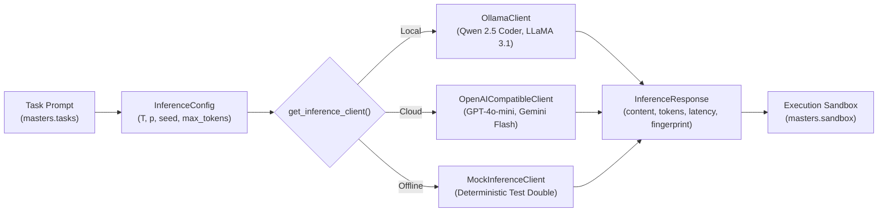

# Unified Inference Engine (`masters.inference`)

The `masters.inference` package provides a unified, statistically reproducible interface for querying Large Language Models across both local Apple Silicon execution engines (via [Ollama](https://ollama.ai)) and cost-effective Cloud APIs (OpenAI, Google Gemini).

## Motivation & Architecture

In accordance with the thesis experimental design, evaluating LLM stochasticity requires strictly controlling generation hyperparameters (temperature $T$, nucleus sampling $p$, top-$k$, and random seeds), logging fine-grained execution metadata (tokens, latency, system fingerprints), and handling runtime exceptions gracefully.



## Public Interface

### 1. Configuration & Response

* **`InferenceConfig`**:
  * `model: str`: Model identifier (e.g. `'qwen2.5-coder:7b'`, `'gpt-4o-mini'`).
  * `temperature: float = 0.0`: Decoding temperature in $[0.0, 2.0]$.
  * `top_p: float = 1.0`: Nucleus sampling cutoff in $(0.0, 1.0]$.
  * `top_k: int | None = None`: Top-k vocabulary filter.
  * `seed: int | None = None`: Random seed for reproducibility testing (RQ3 determinism).
  * `max_tokens: int = 2048`: Maximum generation token limit.
  * `timeout_sec: float = 60.0`: Network request timeout in seconds.
  * `base_url: str | None = None`: Custom endpoint URL.
  * `api_key: str | None = None`: API authorization token.

* **`InferenceResponse`**:
  * `content: str`: Generated response text or code.
  * `model: str`: Model name reported by backend.
  * `latency_sec: float`: Round-trip execution latency in seconds.
  * `prompt_tokens: int | None`: Input tokens consumed.
  * `completion_tokens: int | None`: Tokens generated.
  * `total_tokens: int | None`: Total token footprint.
  * `finish_reason: str | None`: Completion stop reason (`'stop'`, `'length'`).
  * `system_fingerprint: str | None`: Backend engine configuration hash for API drift detection.
  * `raw_metadata: dict[str, Any]`: Full provider response dictionary.

### 2. Available Clients

* **`OllamaClient(base_url="http://localhost:11434")`**:
  Connects to local Ollama server running locally on Apple Silicon. Sends structured payloads including options dictionary (`temperature`, `seed`, `top_p`, `num_predict`).
* **`OpenAICompatibleClient(base_url=..., api_key=...)`**:
  Standard client supporting OpenAI (`https://api.openai.com/v1`), Google Gemini (`https://generativelanguage.googleapis.com/v1beta/openai`), Groq, or vLLM. Includes exponential backoff retries via `tenacity` on HTTP 429 / 503.
* **`MockInferenceClient()`**:
  Offline, zero-network test double generating deterministic responses or cycling through canned responses. Ideal for unit tests, pipeline debugging, and CI environments.
* **`get_inference_client(provider, **kwargs)`**:
  Convenience factory for client instantiation (`'mock'`, `'ollama'`, `'openai'`, `'gemini'`).

### 3. Exception Hierarchy

* `InferenceError` (Base)
  * `InferenceConnectionError`: Server unreachable or offline daemon.
  * `InferenceTimeoutError`: Call exceeded `timeout_sec`.
  * `InferenceRateLimitError`: HTTP 429 rate limit exceeded.
  * `InferenceAuthError`: HTTP 401/403 missing or invalid key.
  * `InferenceResponseError`: Unparseable response or unexpected server error.

---

## Setup Guide

### Local Inference via Ollama (Apple Silicon M4)

1. Install Ollama:
   ```bash
   brew install ollama
   ```
2. Start the Ollama server:
   ```bash
   ollama serve
   ```
3. Pull candidate thesis models:
   ```bash
   ollama pull qwen2.5-coder:7b
   ollama pull llama3.1:8b
   ```

### Cloud APIs

Set environment variables in your local shell or `.env`:
```bash
export OPENAI_API_KEY="sk-..."
export GEMINI_API_KEY="AIzaSy..."
```

---

## Example Usage

### Single-Turn Generation
```python
from masters.inference import InferenceConfig, get_inference_client

# Local Ollama client
client = get_inference_client("ollama")
config = InferenceConfig(
    model="qwen2.5-coder:7b",
    temperature=0.2,
    seed=42,
)

response = client.generate(
    "Write a Python function to impute missing values using column medians.",
    config=config,
)

print("Generated Code:\n", response.content)
print(f"Latency: {response.latency_sec:.2f}s, Tokens: {response.total_tokens}")
```

### Factorial Hyperparameter Grid Run
```python
from masters.inference import InferenceConfig, get_inference_client

client = get_inference_client("mock")
temperatures = [0.0, 0.2, 0.5, 0.7, 1.0]

for temp in temperatures:
    for seed in [101, 202, 303]:
        cfg = InferenceConfig(
            model="mock-qwen-7b",
            temperature=temp,
            seed=seed,
        )
        resp = client.generate("impute_missing(df)", cfg)
        print(f"T={temp}, Seed={seed} -> Latency: {resp.latency_sec:.4f}s")
```
