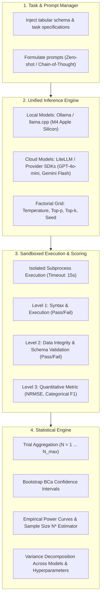
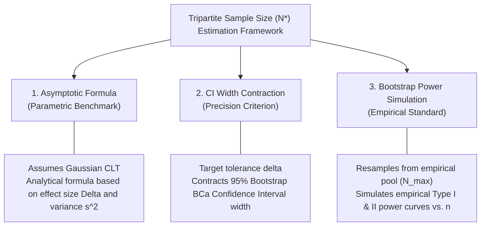
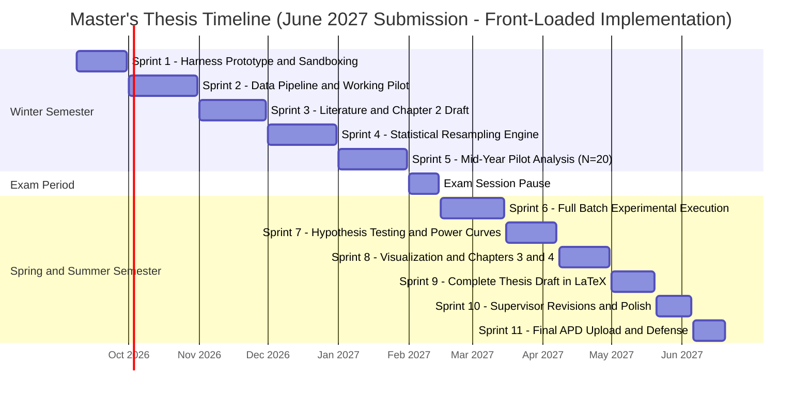

# Master's Thesis Prospectus & PRD

**Author**: Julia Krempińska  
**Institution**: Wrocław University of Science and Technology (Politechnika Wrocławska)  
**Document Version**: 0.1.0 (Draft)  
**Status**: In Progress  
**Language**: English  

---

## 1. Working Titles (Candidate Options)

* **Option A (Methodology-focused)**:  
  *Toward Statistically Rigorous Evaluation of Large Language Models: Sample Size Determination and Variance Analysis in Automated Data Science Tasks*
* **Option B (Problem-focused)**:  
  *Beyond the Single-Run Fallacy: Quantifying Stochasticity and Estimating Minimum Sample Sizes for LLM Evaluation in Data Preprocessing*
* **Option C (Framework-focused)**:  
  *A Statistical Framework for Testing LLM Stability and Reproducibility Across Local and Cloud Models in Tabular Data Analysis*

*(Final title to be refined with thesis supervisor).*

---

## 2. Problem Statement & Motivation

### 2.1 The Problem: The "Single-Run Fallacy" in LLM Benchmarking
A pervasive limitation in current academic literature and industry benchmarks evaluating Large Language Models (LLMs) on code generation and data analysis tasks is the reliance on a single evaluation run (or very few runs) per test case. 

Because LLMs are inherently probabilistic autoregressive models, their outputs are subject to substantial stochasticity driven by:
1. **Sampling Hyperparameters**: Decoding strategies such as temperature \(T > 0\), top-$p$, and top-$k$.
2. **System-Level Non-Determinism**: Even at \(T = 0\), batched GPU inference, floating-point non-associativity in parallel CUDA operations, and API-side dynamic routing introduce non-negligible variance across calls.
3. **Prompt Sensitivity**: Slight perturbations in task framing or few-shot exemplars can trigger divergent reasoning chains.

Evaluating an LLM on a single pass fails to provide statistical guarantees. A model outperforming a baseline in a single run may simply be a lucky sample from an overlapping performance distribution rather than a statistically significant improvement.

### 2.2 Domain Context: Data Preprocessing and Analysis Tasks
Data preprocessing and exploratory data analysis (EDA) represent high-stakes applications of code-generating LLMs. Unlike simple generative text, data preprocessing code directly affects downstream machine learning models and business decisions. Common tasks (such as handling missing values, encoding categoricals, detecting anomalies, and feature transformation) require:
* **Syntactic correctness**: Code must execute without errors.
* **Semantic correctness**: The code must solve the transformation problem as intended.
* **Data validity & stability**: The resulting transformed dataset must preserve integrity across multiple runs without silent data corruption.

### 2.3 The Core Research Need
There is currently no standardized, mathematically sound guideline for practitioners and researchers answering:
* *How many trials ($N$) are necessary to establish statistically confident benchmarks for an LLM on data analysis tasks?*
* *What is the variance profile of different model tiers (local open-weight vs. proprietary cloud-based) under varying parameter settings?*
* *How can we formulate hypothesis tests to prove an observed performance gain is statistically sound rather than a stochastic artifact?*

---

## 3. Objectives & Scope

> **Academic Context**: As a Master's thesis in Mathematics / Applied Data Science, the core contribution is **statistical and methodological**, supported by reproducible empirical experiments. The primary focus is mathematical rigor in hypothesis testing, variance analysis, and sample size determination, rather than production software engineering.

### 3.1 Primary Objective
To develop, formalize, and empirically validate a **statistical framework for quantifying LLM output stochasticity** in tabular data science tasks, establishing mathematical criteria and sample size estimators ($N$) required to achieve statistically valid, reproducible benchmark evaluations.

### 3.2 Specific Objectives
1. **Mathematical Formulation**: Define statistical estimators for LLM performance distribution (mean, variance, confidence intervals via parametric and non-parametric bootstrap methods) under repeated sampling.
2. **Statistical Power & Sample Size Determination**: Derive or empirically estimate the minimum number of iterations ($N^*$) required to detect performance differences between models or hyperparameter configurations with specified significance ($\alpha$) and statistical power ($1 - \beta$).
3. **Variance Characterization**: Measure and decompose output variance across two major dimensions:
   * *Model architecture & deployment type*: Local open-weight vs. Cloud API models.
   * *Generation hyperparameters*: Temperature ($T$), top-$p$, and prompt framing (e.g., zero-shot vs. chain-of-thought).
1. **Empirical Implementation**: Build a lightweight, reproducible test-runner script/harness in Python to orchestrate repeated LLM queries, evaluate syntactic and semantic correctness, and generate statistical test reports.

### 3.3 Task Domain & Benchmarking Scope
The empirical evaluation focuses on modular, well-defined tabular data science tasks where ground-truth or unit-test verification is unambiguous:
* **Task A: Missing Value Imputation** (Handling MCAR, MAR, and MNAR data patterns via code generation).
* **Task B: Feature Transformation & Engineering** (Categorical encoding, scaling, datetime extraction, interaction terms).
* **Task C: Exploratory Data Analysis (EDA) Code Generation** (Computing robust descriptive statistics, distributions, and anomaly summaries).

*(Final task selection to be confirmed in consultation with the thesis supervisor).*

### 3.4 Model Selection & Hardware Fit
* **Local Models ($\le$ 14B parameters)**:
  * Tested on local hardware (**MacBook Air M4, 24 GB Unified Memory, 512 GB SSD**).
  * With 24 GB unified memory, ~16–18 GB is safely allocatable to the model and KV-cache without OS memory swapping.
  * Candidate models: *Qwen 2.5 Coder 7B / 14B (Q4_K_M)*, *LLaMA 3.1 8B (Q4_K_M)*, *Mistral 7B Instruct*.
  * Execution engine: `ollama` or `llama.cpp` / `mlx` for Apple Silicon optimization.
* **Cloud API Models (Cost-Conscious Selection)**:
  * High-capability, cost-effective models to maintain minimal API expense.
  * Candidate models: *OpenAI GPT-4o-mini*, *Google Gemini 1.5/2.0 Flash*, *Anthropic Claude 3.5 Haiku*.

### 3.5 Experimental Variables
* **Decoding Parameters**: Temperature ($T \in \{0.0, 0.2, 0.5, 0.7, 1.0\}$), Top-$p$ ($p \in \{0.8, 0.95, 1.0\}$).
* **Repetition Count ($N$)**: Varying $N$ from 1 to $N_{\max}$ (e.g., $N = 30$ to $100$) to observe empirical convergence and confidence interval contraction.
* **Prompt Strategy (Secondary)**: Zero-shot direct prompting vs. Few-shot / Chain-of-Thought prompting (subject to computational budget).

### 3.6 Out-of-Scope (Explicit Non-Goals)
To maintain academic depth within a realistic timeline and budget, the following are deliberately out of scope:
* **Frontend or GUI development**: No web apps, dashboards, or user interfaces will be developed.
* **Model training or fine-tuning**: Pre-trained and instruction-tuned off-the-shelf models will be utilized strictly in an inference mode.
* **Massive model tiers ($> 32\text{B}$ local or high-tier flagship cloud models)**: Prohibited due to local hardware memory limits and API cost constraints.
* **Unstructured / Multimodal tasks**: Vision-language tasks, raw text NLP, audio, and multimodal data are excluded; experiments are strictly constrained to structured tabular datasets.
* **General-purpose AutoML library development**: The goal is not to produce a competitor to AutoGluon or FLAML, but to study evaluation methodology and stochasticity.

---

## 4. Research Questions & Hypotheses

The thesis formulates four primary research questions, each paired with formal statistical hypotheses to be empirically tested:

### 4.1 RQ1: Sample Size Determination & Benchmark Stability
* **Research Question**: How many independent evaluation trials ($N^*$) are required to reliably estimate an LLM's true expected performance $\mu$ within a margin of error $\epsilon$ at confidence level $(1 - \alpha)$, and to distinguish between two models with statistical power $(1 - \beta)$?
* **Hypothesis $H_{1,0}$ (Null)**: A single evaluation run ($N = 1$) provides an unbiased and statistically sufficient ranking of model performance (observed differences are invariant across runs).
* **Hypothesis $H_{1,1}$ (Alternative)**: Single-run evaluations yield high Type I error rates ($\alpha > 0.20$) in model ranking. The required sample size $N^*$ scales inversely with effect size ($d = |\mu_A - \mu_B| / \sigma$) and can be formalized via bootstrap power analysis.
* **Proposed Statistical Methods**: Asymptotic sample size estimation, Non-parametric Bootstrap Confidence Intervals (BCa), Empirical Power Curves ($1 - \beta$ vs. $N$).

### 4.2 RQ2: Hyperparameter Impact on Performance Variance
* **Research Question**: What is the quantitative functional relationship between decoding temperature ($T \in [0, 1]$), nucleus sampling ($p$), and the variance ($\sigma^2$) of code execution correctness?
* **Hypothesis $H_{2,0}$ (Null)**: The variance of task correctness scores is independent of temperature $T$ ($\sigma^2(T_1) = \sigma^2(T_2)$ for all $T_1, T_2$).
* **Hypothesis $H_{2,1}$ (Alternative)**: Performance variance $\sigma^2(T)$ is a monotonically increasing function of temperature $T$, requiring non-linearly higher sample sizes $N^*(T)$ to maintain fixed estimation confidence.
* **Proposed Statistical Methods**: Levene's Test and Bartlett's Test for homogeneity of variances across temperature strata; polynomial regression of $\hat{\sigma}^2$ on $T$.

### 4.3 RQ3: Deployment Determinism at Temperature Zero
* **Research Question**: Does setting $T = 0$ guarantee deterministic output across local open-weight models and cloud API models in code generation tasks?
* **Hypothesis $H_{3,0}$ (Null)**: Outputs at $T = 0$ are strictly deterministic ($\sigma^2 = 0$) across both local runtimes and cloud API endpoints.
* **Hypothesis $H_{3,1}$ (Alternative)**: While local runtimes with fixed seeds achieve $\sigma^2 \approx 0$, cloud API models exhibit non-zero stochasticity at $T = 0$ due to server-side batching, multi-GPU non-associative floating-point operations, and dynamic routing.
* **Proposed Statistical Methods**: Exact string identity rate, Semantic AST (Abstract Syntax Tree) invariance tests, Levenshtein distance variance across $N = 50$ runs at $T = 0$.

### 4.4 RQ4: Distributional Properties & Test Validity
* **Research Question**: Do performance scores across repeated LLM runs adhere to standard Gaussian assumptions, or do they necessitate non-parametric testing frameworks?
* **Hypothesis $H_{4,0}$ (Null)**: Evaluation scores across repeated runs follow a normal distribution $\mathcal{N}(\mu, \sigma^2)$, satisfying conditions for Student's $t$-tests and standard ANOVA.
* **Hypothesis $H_{4,1}$ (Alternative)**: Binary unit-test pass rates and downstream data transformation metrics exhibit significant skewness, kurtosis, or multimodality, requiring non-parametric alternatives (e.g., Wilcoxon Signed-Rank, Mann-Whitney $U$, or Permutation tests).
* **Proposed Statistical Methods**: Shapiro-Wilk and Anderson-Darling tests for normality; comparison of $p$-values between parametric $t$-tests and non-parametric permutation tests.

> *Note: Minor modifications to specific wording or priority order of RQs may occur following formal consultation with the thesis supervisor.*

---

## 5. Proposed Methodology & Technical Architecture

The technical harness is designed as an automated, modular Python evaluation pipeline composed of four interconnected modules:

### 5.1 Subprocess Sandboxing & Execution Safety
Because LLMs generate arbitrary executable Python code, execution safety and fault-tolerance are critical:
* **Timeout guards**: Every generated script is executed in an isolated `subprocess` with a hard timeout (e.g., 15 seconds) to prevent infinite loops (e.g., convergence failures in iterative imputers).
* **Resource guards**: Subprocesses are constrained in RAM usage to prevent out-of-memory kernel panics on the host machine.
* **Traceback logging**: Uncaught exceptions, standard output, and standard error streams are logged to structured JSON/Parquet files for post-hoc qualitative error taxonomy.

### 5.2 Hierarchical Scoring Framework
To capture the multidimensional nature of code correctness, each run $i \in \{1, \dots, N\}$ receives a composite evaluation record:
1. **$S_{\text{syntax}}^{(i)} \in \{0, 1\}$**: Code compiles, imports valid libraries, and executes to completion without fatal exceptions.
2. **$S_{\text{semantic}}^{(i)} \in \{0, 1\}$**: Output object is a valid DataFrame matching expected dimensions, column names, correct data types, and containing zero unintended `NaN`s or data leakage.
3. **$S_{\text{quality}}^{(i)} \in \mathbb{R}$**: Quantitative performance metric:
   * *For Imputation*: Normalized Root Mean Squared Error ($\text{NRMSE}$) against known ground truth for numeric features; macro-F1 score for categorical features.
   * *For Feature Transformation*: Cross-validated performance ($R^2$ or ROC-AUC) of a standard downstream baseline model (e.g., LightGBM / Ridge) trained on the transformed features.

---

## 6. Experimental Design & Datasets

### 6.1 Dataset Strategy: Controlled Semi-Synthetic Benchmarks
To evaluate mathematical correctness objectively, ground truth is mandatory. The benchmark will utilize well-characterized tabular datasets with **controlled synthetic artifact injection**:
* **Source Datasets**: Standard OpenML / UCI benchmarks representing diverse properties (e.g., *California Housing* for pure continuous features, *Adult Census* for high-cardinality mixed tabular data, *Diabetes* for small-sample medical tabular data).
* **Controlled Missingness Injection (for Imputation Task)**:
  * **MCAR (Missing Completely at Random)**: Uniformly masked values at 5%, 15%, 30% rates.
  * **MAR (Missing at Random)**: Probability of missingness conditioned on observed covariates.
  * **MNAR (Missing Not at Random)**: Probability of missingness conditioned on the unobserved variable itself (e.g., truncated distributions).
* *Advantage*: Enables exact analytical ground-truth distance calculations ($S_{\text{quality}}$) against the true uncorrupted matrix.

### 6.2 Experimental Factorial Grid
For each task and dataset, the experimental grid tests combinations across:
* **Models**:
  * Local: *Qwen 2.5 Coder 7B (Q4)*, *LLaMA 3.1 8B (Q4)*.
  * Cloud: *GPT-4o-mini*, *Gemini 1.5/2.0 Flash*.
* **Temperature ($T$)**: $\{0.0, 0.2, 0.5, 0.7, 1.0\}$.
* **Sample Size ($N$)**: Maximum $N_{\max} = 50$ (or 100) repetitions per condition cell.
* **Total Run Budget**: Estimated at $4 \text{ models} \times 5 \text{ temperatures} \times 3 \text{ datasets} \times 50 \text{ runs} = 3{,}000$ executions.

---

## 7. Evaluation Metrics & Statistical Framework

### 7.1 Primary Performance & Quality Metrics
For each experimental condition cell (Model $M$, Temperature $T$, Task $K$, Dataset $D$) across $N$ repetitions:

1. **Syntactic Execution Success Rate ($\hat{p}_{\text{exec}}$)**:
   $$\hat{p}_{\text{exec}} = \frac{1}{N} \sum_{i=1}^N S_{\text{syntax}}^{(i)}, \quad S_{\text{syntax}}^{(i)} \in \{0, 1\}$$
   Measures code reliability and probability of crash-free execution.

2. **Semantic Data Integrity Rate ($\hat{p}_{\text{valid}}$)**:
   $$\hat{p}_{\text{valid}} = \frac{1}{N} \sum_{i=1}^N S_{\text{semantic}}^{(i)}, \quad S_{\text{semantic}}^{(i)} \in \{0, 1\}$$
   Measures whether output complies with data invariants (no unintended drops, correct schema, no synthetic NaN leakage).

3. **Normalized Root Mean Squared Error ($\text{NRMSE}$)** *(for Imputation Quality)*:
   $$\text{NRMSE} = \frac{\sqrt{\frac{1}{|M|} \sum_{(j,k) \in M} (X_{jk} - \hat{X}_{jk}^{(i)})^2}}{\sigma(X)}$$
   Where $M$ is the mask of injected missing entries, $X$ is the ground-truth clean matrix, $\hat{X}^{(i)}$ is the LLM-imputed matrix, and $\sigma(X)$ is the standard deviation of the true variable.

4. **Categorical Imputation Concordance**:
   Macro-averaged $F_1$ score or Matthews Correlation Coefficient (MCC) between ground-truth masked categories and imputed categories.

### 7.2 Variance & Dispersion Measures
* **Sample Standard Deviation ($s$) & Variance ($s^2$)**:
  $$s^2 = \frac{1}{N - 1} \sum_{i=1}^N \left(S^{(i)} - \bar{S}\right)^2$$
* **Coefficient of Variation ($CV$)**: Scale-independent dispersion metric:
  $$CV = \frac{s}{\bar{S}}$$
* **Interquartile Range ($IQR$) & Median Absolute Deviation ($MAD$)**: Robust non-parametric measures of dispersion unaffected by extreme outliers.

### 7.3 Tripartite Methodology for Minimum Sample Size ($N^*$) Estimation
To provide both analytical and empirical answers to the supervisor and thesis committee, three complementary methodologies will be formulated and compared:

1. **Method 1: Classical Asymptotic Power Formula (Parametric Benchmark)**:
   Assumes approximate normality under the Central Limit Theorem:
   $$N^* \ge \frac{2 \left(Z_{\alpha/2} + Z_{\beta}\right)^2 \sigma^2}{\Delta^2}$$
   Where $\Delta = |\mu_A - \mu_B|$ is the minimum detectable effect size, $\alpha = 0.05$ (significance), and $1 - \beta = 0.80$ (statistical power).
   *Purpose*: Serves as a standard textbook baseline to demonstrate where parametric assumptions fail in LLM benchmarking.

2. **Method 2: Confidence Interval Width Contraction (Precision Criterion)**:
   Determines the minimum sample size $n$ such that the $(1 - \alpha)$ Bootstrap BCa (Bias-Corrected and Accelerated) confidence interval width $W(n) = \hat{\mu}_{U, n} - \hat{\mu}_{L, n}$ satisfies:
   $$\mathbb{P}\left( W(n) \le \delta \right) \ge 1 - \gamma$$
   Where $\delta$ is the user-specified tolerance (e.g., $\pm 2\%$ in accuracy) and $\gamma = 0.05$.

3. **Method 3: Non-parametric Bootstrap Power Simulation (Empirical Standard)**:
   From an empirical pool of $N_{\max} = 50$ (or 100) runs, draw $B = 2{,}000$ bootstrap sub-samples of size $n \in \{2, 3, 5, 10, 15, 20, 30, 40, 50\}$.
   * Empirically calculate the empirical rejection rate of $H_0$ (simulated statistical power) as a function of $n$.
   * Identify $N^*$ as the inflection point where power curves plateau above the $80\%$ or $90\%$ threshold.

### 7.4 Hypothesis Testing & Normality Assessment
* **Normality Testing**: Shapiro-Wilk and Anderson-Darling tests conducted on metric distributions across runs to evaluate validity of parametric methods.
* **Homoscedasticity Testing**: Levene's test and Brown-Forsythe test to assess equality of variances across temperatures $T \in \{0.0, 0.2, 0.5, 0.7, 1.0\}$.
* **Comparative Significance Testing**: If distributions are non-normal, paired Wilcoxon Signed-Rank tests or non-parametric Permutation tests will be utilized in place of Student's $t$-tests.

---

## 8. Resource Constraints & Risk Management

### 8.1 Technical & Environmental Constraints
* **Local Compute Constraint (MacBook Air M4, 24 GB Unified Memory)**:
  * *Constraint*: Total memory shared between macOS (~4–5 GB) and GPU/Neural Engine. Models can safely allocate up to ~14–16 GB active RAM without memory swapping to disk.
  * *Capability*: Readily accommodates both 7B/8B models (e.g., LLaMA 3.1 8B, Qwen 2.5 Coder 7B) and intermediate 14B models (e.g., Qwen 2.5 Coder 14B Q4_K_M ~9 GB) with ample headroom for KV-cache. Batch evaluations can run smoothly and headless overnight.
* **API Cost & Rate Limit Management**:
  * *Constraint*: Cloud APIs (OpenAI, Google) enforce rate limits (RPM/TPM) and can incur unexpected billing if prompts leak into runaway retry loops.
  * *Mitigation*: Standardize on budget-friendly models (*GPT-4o-mini*, *Gemini 1.5/2.0 Flash*) with maximum estimated cost under \$2.00 total. Implement client-side rate limiters with exponential backoff using `tenacity`.
* **Execution Safety & Hanging Subprocesses**:
  * *Constraint*: Generated code may contain unbounded loops or memory leaks.
  * *Mitigation*: Wrap each code evaluation inside an isolated `subprocess.run(..., timeout=15)` call. Automatically classify timeouts as syntax/execution failures ($S_{\text{syntax}} = 0$) and terminate process groups via `SIGKILL`.

### 8.2 Scientific & Academic Risks
| Risk Description | Severity | Likelihood | Mitigation Strategy |
| :--- | :---: | :---: | :--- |
| **Silent API Model Version Drift** | High | Medium | Pin immutable model snapshot tags (e.g., `gpt-4o-mini-2024-07-18`, not dynamic alias `gpt-4o-mini`). |
| **Crash Mid-Batch ($N = 1000+$)** | High | Medium | Write each trial atomically to SQLite or append-only Parquet. Include `--resume` flag in test runner. |
| **Supervisor Task Scope Change** | Medium | Medium | Modular architecture: Task definitions (imputation vs. transformation) are abstracted plugins that can be swapped without rewriting the statistical core. |
| **Non-Normal Error Distributions** | Low | High | Pre-emptively built non-parametric bootstrap and permutation testing into the core statistical engine. |

---

## 9. Timeline & Granular Micro-Milestones (Submission: June 2027)

> **Workload Profile**:
> * **Winter Semester (Sept 2026 – Jan 2027)**: *Low-to-moderate intensity* (approx. 5–8 hours/week alongside coursework). Focus on theoretical foundation, harness architecture, and data generation.
> * **Exam Period (Feb 1 – Feb 14, 2027)**: University exam session; temporary pause.
> * **Early Spring & Summer Semester (Feb 15 – Jun 2027)**: *High intensity* (approx. 15–20 hours/week). Starts mid-February with full-scale batch experiments, followed by statistical analysis, dissertation drafting, and defense.

### 9.1 Winter Semester: Front-Loaded Implementation & Foundation (Sept 2026 – Jan 2027)

#### **Sprint 1: Core Harness Prototype & Sandboxing (Sept 8 – Sept 30, 2026)**
* **Deliverables**:
  - [ ] Pitch `thesis_prd.md` to supervisor; discuss preliminary research questions.
  - [ ] Implement `src/masters/sandbox/` executing generated code with 15s timeout, memory limit, and output extraction.
  - [ ] Implement `src/masters/inference/` supporting local Ollama (`Qwen 2.5 Coder 7B/14B`) and Cloud APIs via LiteLLM.
  - [ ] Unit tests for sandbox isolation, exception logging, and return-code parsing.

#### **Sprint 2: Synthetic Data Pipeline & Live Working Pilot (Oct 1 – Oct 31, 2026)**
* **Deliverables**:
  - [ ] Implement `src/masters/tasks/` with modular `BaseTask` interface.
  - [ ] Build dataset loaders (California Housing, Adult, Diabetes) and controlled missingness injectors (MCAR/MAR/MNAR).
  - [ ] Run end-to-end pilot batch ($N = 5$) to demonstrate working pipeline to supervisor.
  - [ ] Formal supervisor sign-off on thesis title and scope backed by live pilot results.

#### **Sprint 3: Literature Review & Chapter 2 Draft (Nov 1 – Nov 30, 2026)**
* **Deliverables**:
  - [ ] Survey literature on LLM non-determinism, code generation benchmarks, and bootstrap power analysis.
  - [ ] Draft Chapter 2 (Literature Review & State of the Art).
  - [ ] Document formal statistical definitions of sample size determination formulas.

#### **Sprint 4: Statistical Resampling Engine (Dec 1 – Dec 31, 2026)**
* **Deliverables**:
  - [ ] Implement `src/masters/stats/` (Bootstrap resampling, BCa confidence intervals, power curve calculator).
  - [ ] Implement parametric asymptotic sample size formulas and normality tests (Shapiro-Wilk, Levene).
  - [ ] Test statistical engine on pilot synthetic datasets.

#### **Sprint 5: Pilot Analysis & Scaling Validation (Jan 1 – Jan 31, 2027)**
* **Deliverables**:
  - [ ] Run scaled pilot ($N = 20$ repetitions) across 2 models and 2 temperatures.
  - [ ] Verify atomic logging (SQLite/Parquet) and resume capabilities.
  - [ ] Mid-year checkpoint meeting with supervisor showing preliminary empirical variance plots.

---

### 9.2 Exam Period Pause (Feb 1 – Feb 14, 2027)
* University exam period; active development paused.
* Review pilot data and refine draft table of contents.

---

### 9.3 Spring & Summer Semester: Execution, Analysis & Writing (Feb 15 – Jun 2027)

#### **Sprint 6: Full Experimental Grid Execution (Feb 15 – Mar 15, 2027)**
* **Deliverables**:
  - [ ] Kick off full headless batch runs mid-February across 4 models $\times$ 5 temperatures $\times$ 3 datasets.
  - [ ] Reach $N = 50$ (or 100) completed iterations per cell (total ~3,000 runs).
  - [ ] Export sanitized, immutable benchmark evaluation dataset.

#### **Sprint 7: Statistical Engine & Hypothesis Testing (Mar 16 – Apr 7, 2027)**
* **Deliverables**:
  - [ ] Compute normality tests (Shapiro-Wilk) and variance tests (Levene/Bartlett).
  - [ ] Execute non-parametric bootstrap resampling ($B = 2{,}000$) across sample sizes $n \in [2, 50]$.
  - [ ] Evaluate Type I error and empirical power for model comparison ($1 - \beta$).
  - [ ] Compare theoretical asymptotic $N^*$ vs. empirical bootstrap $N^*$.

#### **Sprint 8: Results Visualization & Drafting Chapters 3–4 (Apr 8 – Apr 30, 2027)**
* **Deliverables**:
  - [ ] Generate publication-quality figures (power curves, variance vs. temperature plots, CI width contraction).
  - [ ] Draft Chapter 3 (Experimental Methodology & System Architecture).
  - [ ] Draft Chapter 4 (Empirical Results, Variance Decomposition, Sample Size Recommendations).
  - [ ] Draft Chapter 5 (Discussion, Threats to Validity, Engineering Recommendations).

#### **Sprint 9: Complete Thesis Draft Assembly in LaTeX (May 1 – May 20, 2027)**
* **Deliverables**:
  - [ ] Draft Chapter 1 (Introduction & Problem Statement) and Chapter 6 (Conclusion & Future Work).
  - [ ] Compile complete draft in LaTeX (using official PWr thesis template).
  - [ ] Submit complete first draft to supervisor for thorough review.

#### **Sprint 10: Revisions, Formatting & Plagiarism Check (May 21 – Jun 5, 2027)**
* **Deliverables**:
  - [ ] Implement supervisor feedback and revisions.
  - [ ] Finalize code repository documentation, clean dependencies, and verify reproducibility.
  - [ ] Run official university anti-plagiarism check (JSA).

#### **Sprint 11: Final APD Upload & Defense (Jun 6 – Jun 20, 2027)**
* **Deliverables**:
  - [ ] Upload final PDF and code to PWr APD (Archiwum Prac Dyplomowych) system.
  - [ ] Receive supervisor and reviewer reviews.
  - [ ] Prepare defense presentation slides and rehearse defense.
